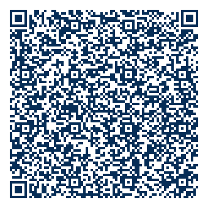

# Simplex-desktop

A desktop application for [simplex-chat](https://simplex.chat). WIP, contributions are welcome.

## Architecture

For the back end we rust with [tauri](https://tauri.app) and frontend is built with [yew-rs](https://yew.rs)

## For developers

To get started with development you need a bunch of things, what is missing here can be found [here](https://tauri.app/v1/guides/getting-started/prerequisites#installing). 

1. You will need rust, for linux use rustup:

    ```shell
    curl --proto '=https' --tlsv1.2 https://sh.rustup.rs -sSf | sh
    ```
1. Then you'll need tools for yew. Find detailed instuctions [here](https://yew.rs/docs/getting-started/introduction)
    ```shell
    rustup target add wasm32-unknown-unknown
    cargo install trunk
    cargo install wasm-bindgen-cli
    ```
1. And at least the tauri cli
    ```shell
    cargo install tauri-cli
    ```

Now you should be able to to run the app with
```shell
cargo tauri dev
```

## Join the discussion

You can join us on simplex via [group link](https://simplex.chat/contact#/?v=1-2&smp=smp%3A%2F%2FSkIkI6EPd2D63F4xFKfHk7I1UGZVNn6k1QWZ5rcyr6w%3D%40smp9.simplex.im%2FB_usnNovum0Jm125FYrsWfQQcxSjuLHd%23%2F%3Fv%3D1-2%26dh%3DMCowBQYDK2VuAyEAVX4l3f9oqnGb_Ebj8bCiYKgCVb5MHc-EYsM54IMSB3I%253D%26srv%3Djssqzccmrcws6bhmn77vgmhfjmhwlyr3u7puw4erkyoosywgl67slqqd.onion&data=%7B%22type%22%3A%22group%22%2C%22groupLinkId%22%3A%22ILhMYy-DR6l5KK3dfrpx9Q%3D%3D%22%7D)
Or by scanning the scanning the below qr-code in the app.


